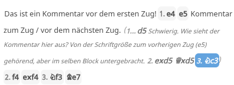
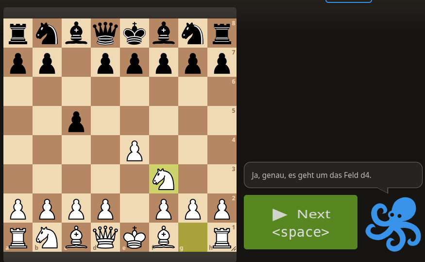
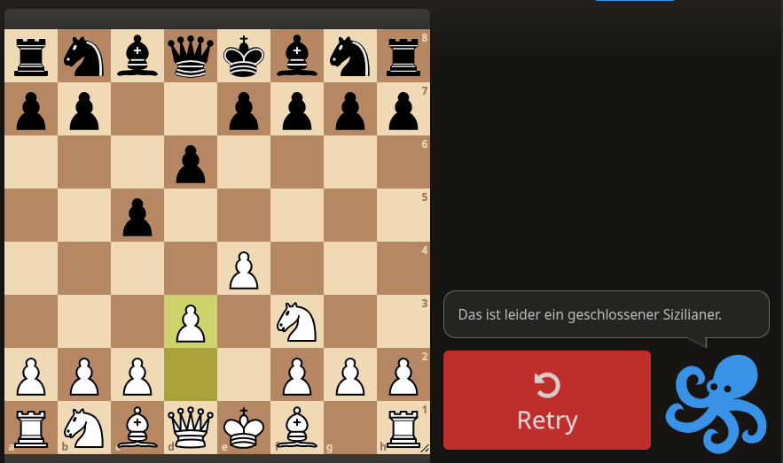

# Basisnutzung von Lichess-Studien

REGIE: Das Folgende sind Vorschläge mit Themenblöcken, die dann durch die konkrete Ausgestaltung ersetzt werden.

## Das Brett

- Umgang mit dem Brett
- Optionen wie beim Spielen / bei der Analyse
- Optionen relevant für Studien

Zur Bedienung des Bretts über die Tastatur, siehe [Tastenkürzel](#key-shortcuts).

## Die Notation samt Erweiterungen

- Wie entsteht die Notation?
- Welche Ergänzungen sind wie möglich?
- Umgang mit Kommentaren und Varianten
- Optionen des Hamburger-Menus

## Weitere Optionen unter dem Brett

### Was sind die Tags, welche davon sollten wann wie gefüllt werden?

### Die Bedeutung der Buttons `SYNC` und `REC`

Die Buttons `SYNC` und `REC` dienen dazu, die Studie zu steuern. Dazu müssen wir ein wenig tiefer eintauchen und betrachten die folgenden Szenarien:

* Der Editor alleine in seiner Studie
* Der Trainer alleine beim Durchspielen der Studie (nicht: erstellen)
* Der Editor zusammen mit Teilnehmern in der Studie (im Sync-Modus)

#### Der Editor alleine

Während der Erstellung einer Studie (unabhängig von den Einstellungen) haben die zwei Knöpfe die folgende Bedeutung:

* Der `SYNC`-Knopf ist irrelevant, er spielt nur eine Rolle, wenn man gemeinsam mit anderen in einer Studie ist.
* Der `REC`-Knopf bestimmt, ob gespielte Züge in die Studie übernommen werden.

Das bedeutet, dass man gefahrlos Dinge ausprobieren kann, wenn der `REC`-Knopf auf `AUS` gestellt ist. Die Züge werden zwar in der Studie angezeigt, aber nicht gespeichert. Wenn man den `REC`-Knopf auf `AN` stellt, dann werden die zwischendurch im Modus REC==`AUS` gespielten wieder verworfen, es geht da weiter, wo man vorher war. Daher gibt es keine (einfache) Möglichkeit, ausprobierte Züge dann später wieder zu speichern.

#### Der Trainer alleine

Ist der Trainer der Ersteller der Studie, sind wir im Modus oben. Ist der Trainer in einer anderen Rolle unterwegs, dann haben wir das folgende Verhalten (separat pro Rolle beschrieben):

* Trainer ist Mitwirkender: Der Trainer kann zwar die Studie verändern, d.h. auch er hat die REC und SYNC Knöpfe sichtbar, aber er sieht leider die verborgenen Züge nicht. Aber wenn er die Züge, die folgen, errät, werden diese in der Notation angezeigt. Führt er Züge aus, die nicht in der Studie sind, dann werden diese mit aufgenommen, wenn der REC-Button auf `AN` gestellt ist. Sie werden aber nicht in seiner Notation angezeigt! Und ein nur Mitwirkender kann diese Einstellung nicht ändern, da sie alleine vom Besitzer der Studie vergeben ist.
  Damit ist der Trainer als (nur) Mitwirkender bedauerlicherweise nicht in der Lage, mit der Studie vollumfänglich zu arbeiten. Die Empfehlung hier ist, dass er zuerst eine Kopie der Studie erstellt, diese dann seinen Vorstellungen nach modifiziert, bevor er den Unterricht beginnt.
* Trainer ist kein Mitwirkender, bzw. nicht in der Studie: Kein Unterschied mehr zu einem Teilnehmer, weder `REC` noch `SYNC` Knopf sind zu Beginn sichtbar, der Trainer ist wie ein passiver Teilnehmer. Sobald durch einen anderen die Stellung verändert wird, taucht der `SYNC` Knopf mit einer Zahl auf. Durch Drücken des `SYNC` Knopfes kommt man wieder in die aktuelle Stellung zurück, der `SYNC`-Knopf verschwindet wieder. Der Trainer kann damit in der Studie nichts steuern!

#### Der Editor zusammen mit anderen

Das ist die übliche Trainingssituation, und hier ist es wichtig, dass man versteht, dass **Züge nur im REC Modus aufgenommen werden, und nur diese Züge dann per SYNC mit anderen Teilnehmern geteilt werden können**. Daher kann man mit anderen nur dann Ad-hoc-Varianten ausprobieren, wenn diese dann in der Studie gespeichert werden. Die Kombination REC==off und SYNC==on ist nicht möglich!

Es gibt hier einen einfachen Trick (der auch Nachteile hat): Wenn man in einer Studie etwas zusätzlich zeigen möchte, ohne die Studie dauerhaft zu verändern, kann man mit einem Clone der Studie arbeiten. Das ist dann aber nur eine Kopie, man sollte sich nur angewöhnen, Einmal-Kopien dann hinterher gleich wieder zu löschen.

### Kommentare: was geht, was nicht

Kommentare sind nach PGN überall erlaubt. Dies wird von Studien gut unterstützt und spielt speziell dann eine Rolle, wenn man interaktive Aufgaben designed, oder Züge verbirgt. Der Kommentar vor dem ersten Zug ist immer sichtbar. Alle weiteren Kommentare werden nun zwischen 2 Zügen eingefügt, und es ist ein wenig philosophisch, oder der Kommentar zum Zug davor oder danach gehört. Am besten sieht man dies, wenn man Varianten spielt. Von der UI her gibt es keine Möglichkeit, dies zu unterscheiden.

Hier die zwei Screenshots, einmal die Inline-Notation, dann die in Spalten.

Aufgrund der Darstellung neige ich dazu, Kommentare immer auf den vorherigen Zug zu beziehen. So sind diese auch leichter für den Leser zu verstehen.

Kommentare können in jeder beliebigen Sprache erstellt werden, aber Sonderzeichen können evtl. verloren gehen, je nach der späteren Verarbeitung. Es handelt sich dabei um reinen Text, es werden keine komplexeren Textformate wie z.B. Markdown unterstützt. Leider auch keine Emoticons oder Smileys (die dann als echte Bilder gerendert werden).

Die einzige Ausnahme bilden hier Links, die dann auch als Link gerendert werden. Umbrüche bleiben erhalten, es gibt natürlich später keine Gewähr, dass diese in der weiteren Verarbeitung korrekt sind.

Wenn man Kommentare in mehrfach eingebetteten Varianten hat, so werden diese in immer kleineren Fonts dargestellt. Dabei werden Kommentare immer inline in allen Varianten angezeigt, nur top-level Kommentare werden ohne Einrückung dargestellt. 

#### Kommentare in verborgenen Varianten

Wenn man Studien erstellt, um neue Themen anderen beizubringen, dann sollte man darauf achten, wann Kommentare für diese sichtbar sind. Wird ein Zug verborgen, dann wird mit ihm auch der Kommentar nach dem Zug verborgen. D.h. wenn man etwas interaktiv fragen möchte, dann sollte die Antwort nicht vorher schon sichtbar sein. 

#### Kommentare in Interaktiven Übungen

Interaktive Übungen (LINK) dienen dazu, Lernende selbständig Übungen durchführen zu lassen. Dazu wird die Main Line gespielt, und der Lernende muss für eine Seite die Züge erraten. Die Kommentare vor dem Zug des Lernenden werden dann statt des Standardkommentars (Was würdest du in dieser Stellung spielen?) angezeigt. Damit kann man die Übungen lebendiger gestalten.

Fügt man einen Kommentar nach einem Zug des Lernenden ein (d.h. einen Fehler, mit dem man rechnet), dann wird dieser Kommentar auch dann sichtbar, wenn der Lernende diesen falschen Zug ausführt. Wenn man einen Kommentar nach einem Zug des Lernenden in der Hauptvariante einfügt, dann wird dieser Kommentar auch angezeigt, durch Drücken der Leertaste geht es dann weiter. 

### NAGs im Detail

### Computeranalyse und Multi-Brett

### Möglichkeiten zum Teilen

## Das Eröffnungsbuch & die Tablebase

- Wie kann man das Eröffnungsbuch in Studien nutzen?
- Und wie funktioniert hier die Tablebase?

## Übergänge zu Studien

Wie kommt man von unterschiedlichsten Stellen in Lichess in eine Studie, welche Möglichkeiten hat man dabei?

- Aufnahme von Spielen in eine Studie.
- Hinzufügen der aktuellen Analyse zu einer Studie.
- Aufnahme einer Stellung des Brett-Editors in eine Studie.

## Tastenkürzel {#key-shortcuts}

Relativ unbekannt, aber vor allem für Power User sehr nützlich. Ich weiß nicht, seit wann die Tastenkürzel für die Navigation auf dem Brett eingeführt wurden. Einige davon kennen viele, andere sind weniger bekannt. Ich versuche mich hier an die Kategorien der Lichess-Hilfe zu halten. Ich habe auch unterschiedliche Erfahrungen mit dem Kürzel für die Tastaturhilfe gemacht, aber noch nicht genau herausbekommen, wann es funktioniert.

| Kürzel | Bedeutung | Erklärung |
|--------|-----------|-----------|
| `?` | Tastaturhilfe | Öffnet die Hilfe, aus der ich die folgenden Kürzel entnommen habe. |
| **Navigation** |||
| Pfeil links/rechts :arrow_left:/:arrow_right:  | Zug vor/zurück | |
| k/j  | Zug vor/zurück | ähnliche Kürzel wie VIM |
| `SHIFT` :arrow_up:/:arrow_down: | Variante wählen | Funktioniert nur beim Zug vor einer Variante. Erster Zug ist immer die Hauptvariante. Danach :arrow_right: für den Einstieg in die Variante. |
| `SHIFT` :arrow_left:/:arrow_right: | Springt zur vorigen / nächsten Variante | Man landet auf dem Zug direkt vor der Variante, und kann dann die Variante auswählen. |
| :arrow_up:/`0`/`Pos1` | Springt zum ersten Zug | |
| :arrow_down:/`$`/`Ende` | Springt zum letzten Zug der Hauptvariante. | Auch, wenn der Rest der Partie über "Variante erzwingen" zu einer Variante gemacht wurde. `$` hat bei mir nicht funktioniert.  |
| `n` | Nächstes Kapitel | |
| `p` | Vorheriges Kapitel | |
| Mouse Scroll | Züge vor-/zurückspulen | Mit der Maus kann man die Züge vor-/zurückspulen. Das geht oft viel schneller, und dennoch exakt. |
| `c` | Chat-Eingabefeld fokussieren | Danach kann man direkt einen Chateintrag absetzen (sofern der Chat erlaubt ist). |
| `d` | Kommentiere diese Stellung | Springt dann in das Kommentarfeld. Das geht auch vor dem ersten Zug (eine Art Spielkommentar zu Beginn). |
| **Analyse** |||
| `l` | Computeranalyse ein/aus | Stockfish wird dann mit den letzten Einstellungen gestartet/gestoppt.|
|  z | Alle Computeranalysen aktivieren / deaktivieren | Dies inkludiert `l` von oben. Ich konnte keinen weiteren Unterschied feststellen. Der Tab `Computer-Analyse` wird ebenfalls deaktiviert.|
| Leertaste | Spiele den besten Computerzug | Wenn Stockfish noch nicht aktiviert ist, wird er hiermit aktiviert, und der beste Zug wird sofort gespielt. |
| `SHIFT` `I` | Inline-Notation an-/ausschalten | |
| `x` | Bedrohungen anzeigen | Siehe  |
| `a` | Pfeil für den besten Zug | Setzt voraus, dass die Computeranalyse an ist. Die Dicke der Pfeile steht für ihre Güte. |
| `v` | Variantenpfeile ein-/ausschalten | Diese überlagern sich teilweise mit den Pfeilen für die besten Zügen. Der Pfeil für die  Hauptvariante ist größer als die anderen.  |
| `e` | Eröffnungs-/Endspielexplorer ein-/ausschalten | Je nach Phase, in der das Spiel ist. |
| `SHIFT` `SPACE` | Spielt den besten Explorerzug. | Setzt natürlich voraus, dass der Explorer aktuell aktiv ist. |
| `r` | Fordere eine Computer-Analyse an | Hat für mich zu keinem Zeitpunkt funktioniert. |
| `ENTER` | Als nächstes: Lerne aus Deinen Fehlern | Keine Ahnung, was die Bedeutung davon ist. |
| `b` | Nächster grobe Patzer | Jeder eigene Zug, der mit `??` markiert ist. |
| `m` | Nächster Fehler | Jeder eigene Zug, der mit `?` markiert ist. |
| `i` | Nächster fragwürdiger Zug | Jeder eigene Zug, der mit `?!` markiert ist. |
| **Kommentare** |||
| C | Kommentar hinzufügen/bearbeiten | Zeigt / verbirgt alle textuellen Kommentare. |
| `SHIFT` `C` | Zeige / verberge Kommentare | Zeigt / Verbirgt alle textuellen Kommentare. Annotationen an den Zügen bleiben sichtbar und erhalten. |
| `g` | Zeigt den mit Symbolen annotieren Dialog | |
| `1`\|`3`\|`5` | Guter \| Brillianter \| Interessanter Zug | Steht für `!`, `!!`, `!?`. Jeweils nur eine Möglichkeit auswählbar. |
| `2`\|`4`\|`6` | Fehler \| Grober Patzer \| Fragwürdiger Zug | Steht für `?`, `??`, `?!`. Jeweils nur eine Möglichkeit auswählbar. |
| `SHIFT` `1` - `8` | Die zweite Spalten im  Annotationen-Dialog, von ausgeglichen bis gewonnen. | Ausgeglichene Stellung (`=`) / Unklare Stellung (`∞`)    Leichter Vorteil Weiß / Schwarz (`⩲`/`⩱`)    Weiß / Schwarz steht besser (`±`/`∓`)    Weiß / Schwarz gewinnt (`+−`/`-+`).   Nur eine der 8 Möglichkeiten pro Zug auswählbar. |

Noch eine wichtige Anmerkungen:

* Die allermeisten Tastaturkürzel gelten nur für das lokale Brett, die lokale Anzeige der Studie, und haben keine Auswirkung für alle anderen, die in der Studie sind.
* Wo dies der Fall ist, habe ich es explizit erwähnt.

## Typische Szenarien in der Nutzung

- Analysieren Sie Partien potenzieller Gegner.
- Bereiten Sie spezifische Eröffnungsvarianten vor.
- Dokumentieren Sie typische Mittel- und Endspielstrategien Ihrer Gegner.
- Erstellen Sie einen Turnierplan mit Zielen und Strategien.
