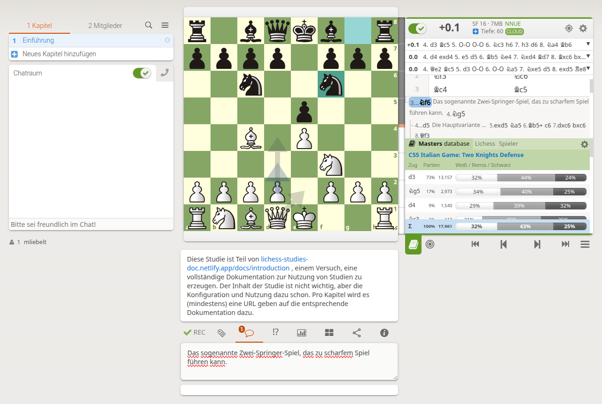

# Erste Schritte mit Lichess-Studien

## Ein Konto erstellen

1. Besuchen Sie [Lichess.org](https://lichess.org).
2. Klicken Sie auf "Anmelden" in der oberen rechten Ecke.
3. Wählen Sie "Registrieren".
4. Füllen Sie das Formular aus mit:
   - Benutzername
   - E-Mail-Adresse
   - Passwort
5. Akzeptieren Sie die Nutzungsbedingungen.
6. Klicken Sie auf "Registrieren".
7. Bestätigen Sie Ihre E-Mail-Adresse über den zugesandten Link.

Das müssen Sie natürlich nur 1 Mal tun. Ab da können Sie sich einfach mit ihrem Benutzerkonto (der Benutzername, den Sie gewählt haben) und ihrem Passwort in einem aktuellen Browser ihrer Wahl anmelden. Meist erinnert sich Lichess an Sie, solange Sie sich nicht explizit abmelden.

Es ist prinzipiell möglich, mehrere Accounts bei Lichess anzulegen, aber das sollte nicht übertrieben werden und wird auch nicht gerne gesehen. Wir haben für unseren Schachclub ein eigenes Lichess-Konto angelegt, und nutzen das für den gesamten Verein. Und meist wird mit dem Account dann auch Studien erstellt, damit alle Leute im Club die Studien gemeinsam verwalten können. Bei Beachtung einiger Prinzipien funktioniert das sehr gut.

## Navigation der Lichess-Oberfläche

- **Hauptmenü**: Oben auf der Seite finden Sie Links zu verschiedenen Bereichen wie Spielen, Lernen, Community und Werkzeuge.
- **Studien**: Unter "Lernen" finden Sie den Link zu "Studien".
- **Benutzerprofil**: In der oberen rechten Ecke können Sie auf Ihren Benutzernamen klicken, um Ihr Profil und Einstellungen zu verwalten.

Da wir hier vor allem die Studien beschreiben wollen, erklären wir nur, welche Bestandteile der Oberfläche hier relevant sind. Dies sind:

* \<Benutzername\> > Sprache: Sie können die Sprache für die Benutzung der Oberfläche umstellen, dies hat einen sofortigen Effekt. Aber: Nicht alle Teile der Studienoberfläche sind gut internationalisiert. Für die Nutzung dieser Dokumentation sollten Sie die Oberfläche auf Deutsch (bzw. für den [englischen Teil](/en/docs/first-steps) auf English) umgestellt haben.
* Es gibt ansonsten unter den Einstellungen viel zur Darstellung des Brettes, der Notation usw., aber das gilt für alle Werkzeuge gleichermaßen. Es gibt keine spezifischen Einstellungen für Studien selbst, diese werden individuell bei jeder Studie neu gemacht.

## Ihre erste Studie erstellen

1. Navigieren Sie zum Bereich "Studien".
2. Klicken Sie auf "Neue Studie".
3. Geben Sie einen Namen für Ihre Studie ein.
4. Wählen Sie die Privatsphäre-Einstellungen (Stichwort Sichtbarkeit: öffentlich, ungelistet oder privat).
5. Klicken Sie auf "Start".
6. Sie sehen nun direkt den Erstellungsdialog für die Erstellung eines einzelnen Kapitels.
7. Lassen Sie die Einstellungen, wie sie sind, und Bestätigen Sie mit "Kapitel erstellen".

Glückwunsch! Sie haben Ihre erste Lichess-Studie erstellt und sind bereit, tiefer in die Welt der Schachanalyse einzutauchen. Machen Sie gleich ein paar Experimente: Machen Sie einige Züge (Hauptvariante); gehen Sie einige Züge zurück (die Züge werden automatisch gespeichert und bleiben erhalten); wählen Sie nun eine Variante (und es entsteht eine Variante im Schach, ohne Obergrenze).

*Figure 1: Beispiel einer Studie mit nur einem Kapitel, siehe [Link dazu](https://lichess.org/study/G0W09DYp/EWTIrVwa#last)*

## Aufbau der Oberfläche einer Studien

Die Lichess-Studie hat einen systematischen Aufbau, den man bei der Nutzung kennen sollte. Dabei werden die einzelnen Teile (je nach vorhandenem Platz) unterschiedlich dargestellt. Hier eine knappe Übersicht:

* Linke Seite: Verwaltung der Studie (das Zahnrad für Kapitel, das Hamburger Menü für die Einstellungen der Studie), Einteilung in Kapitel, Verwaltung der Mitglieder, Suche, und ein großer Chatraum, den jeder Benutzer ein- oder ausschalten kann.
* Das Brett: Dasselbe Brett wie bei der Analyse, oder auch dem Online-Spiel. Alle Änderungen an den Bretteinstellungen werden hier automatisch übernommen.
* Notation und Werkzeuge rechts: Oben Stockfish mit seiner Konfiguration (später mehr); darunter die Züge der Notation, inlusive der Variante, Kommentare, NAGs, ...; darunter die Navigation (Buttons für Anfang, zurück, vor, Ende und weitere Optionen), ganz links die Eröffnungs- und Endspieldatenbank.
* Unten
  * Wenn so eingestellt, der Studienkommentar. Von mir hier genutzt, um auf die Dokumentation zu verweisen (mal sehen, wann die Studie von anderen entdeckt wird).
  * Darunter dann verschiedene Reiter für zusätzliche Werkzeuge, hier das Kommentarfeld.

Damit lassen wir es für den Moment genug sein. Sie können ihre erstellte Studie nun an andere weitergeben, indem Sie einfach in die URL-Zeile ihres Browsers klicken, und die URL dort kopieren. Diese URL steht für ihre Studie, und ist alles, was Sie brauchen, um die Studie zu sharen. Mehr dazu später, wenn es um das Sharen von Studien geht.
