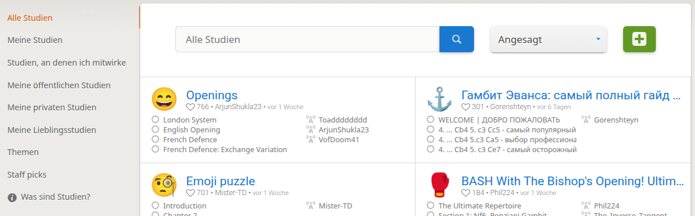
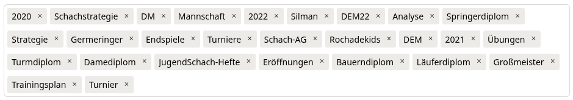

# Struktur von Lichess-Studien

## Verwaltung der Studien

Bevor wir uns den Aufbau einer Studie und ihre Einstellungen anschauen, hier einige Hinweise zur Verwaltung von Studien in Summe.

*Figure 2: Verwaltungsoberfläche für Studien*

* Studien werden dananch klassifiziert, wem sie gehören, und ob Sie darauf Zugriff haben.
* Damit sind die ersten Einträge die Folgenden:
  * Alle Studien: Alle Studien, auf die Sie Zugriff haben, und die durchsuchbar sind. D.h. Sichtbarkeit öffentlich bzw. Mit Einladung. Eine Studie, zu der Sie nicht eingeladen sind mit der Sichtbarkeit "Ungelistet" wird hier nicht aufgeführt.
  * Meine Studien: Alle Studien, deren Besitzer ich bin.
  * Studien, an denen ich mitwirke: Alle Studien, bei denen Sie Mitwirkender (Schreibrechte) oder Mitglied (Leserechte) sind.
  * Meine öffentlichen Studien: Der Titel ist hier eindeutig, es werden nur Studien angezeigt, die ihnen gehören, und die die Sichtbarkeit "Öffentlich" haben.
  * Meine privaten Studien: Alle Studien, die ihnen gehören, und die entweder Sichtbarkeit "Ungelistet" oder "Nur mit Einladung" haben.
  * Meine Lieblingsstudien: Studien, auf die Sie Zugriff haben, und denen Sie ein Herz geschenkt haben.
  * Themen: Einstieg in die Verwaltung der Studien über Themen, siehe Kapitel darunter.
  * Staff Picks: Studien, die öffentlich sind, und von den Betreibern von Lichess vorgeschlagen werden. Hier werden aktuell die Kategorien Opening (Eröffnung), Middlegame (Mittelspiel), Endgame (Endspiel), World Chess Championships (Weltmeisterschaften), Miscellaneous (Verschiedenes) und Puzzle Packs (Puzzle-Pakete) unterschieden.
  * Was sind Studien?: Die einzige Beschreibung zu Studien, die einen sehr guten Überblick gibt, aber vieles offen lässt. Hier ist der [Link](https://lichess.org/@/lichess/blog/study-chess-the-lichess-way/V0KrLSkA).

### Umgang mit Themen

Themen (engl. Tags) in den Studien sind Möglichkeiten, Stichwörter in eine Studie zu packen, um sie leichter wiederzufinden. Wenn man nun glaubt, dass man das nicht braucht, sollte man sich daran erinnern, wenn man unter den (inzwischen) 150 Studien sucht. Wir können hier keine passende Struktur für alle vorgeben, aber erklären, wo Themen helfen können.

*Figure 3: Katalog von Themen*

Ich erstelle für unseren Verein einen gut Teil der Studien, und komme mit der folgenden Struktur  gut zurecht:

* Manche Studien haben einen Zeitbezug, dort hilft die Jahreszahl. Hier sind z.B. Partien von Spielern auf Turnieren, die anschließend gemeinsam analysiert werden sollen.
* Viele Studien sind für einen bestimmten Teilnehmerkreis gedacht: für die Mannschaft; die Schach-AG; das Jugendschach. Damit hat man eine erste Unterscheidung.
* Teilweise ist das noch zu grob. Wir hatten früher die Brackeler-Methode verwendet (heute: Stappen), und haben die Begriffe "Bauerndiplom" (Stappen 1), "Springerdiplom" (Stappen 2), "Läuferdiplom" (Stappen 3), "Turmdiplom" (Stappen 4), "DameDiplom" (Stappen 5). Das passt recht gut, ich habe dann 3-5 Studien pro Stappen-Lehrerheft.
* Frei erstellte Studien haben oft einen Bezug zum Schach: Eröffnung, Strategie, Taktik, Endspiel, ...
* Oft nimmt man Bücher, und extrahiert darauf einige Kapitel oder Abschnitte. Bei sehr viel Material (Silman) lohnt sich auch hier ein Thema.

Der Zugang in der Lichess Oberfläche ist nun dieser:

1. Sie gehen auf ihre Studien, dort auf die Themen.
2. Sie sehen nun eine Liste aller Themen, die Sie bisher in Studien verwendet hatten.
3. Beim Klicken auf ein Thema werden rechts alle Studien angezeigt, in denen dieses Thema verwendet wurde.

Alternativ kann man auch ein Thema irgendwo anklicken, und es werden alle Studien mit dem Thema angezeigt.

Einschränkung: Leider lassen sich Themen nicht miteinader (mit und und oder) verknüpfen. Aber vielleicht kommt das noch irgendwann.

## Aufbau einer Studie

Beim Erstellen einer Studie müssen Sie einige Informationen angeben, wir gehen kurz durch, was die Bedeutung dieser Angaben sind:

1. **Flair**: Sie können jeder Studie ein Icon vorgeben, das dann mit der Studie angezeigt wird. Möglicherweise, wenn man die Studie sinnvoll strukturiert, kann man dann in einer langen Liste von Studien die besser voneinander unterscheiden.
1. **Name**: Der Hauptname Ihrer Studie. Dieser wird in der Liste der Studien angezeigt, zusammen mit anderen Informationen. Ansonsten hat der Name keine Bedeutung. Mehr zur Wahl von sinnvollen Namen, wenn wir tiefer in die Organisation von Studien einsteigen.
2. **Sichtbarkeit**: Aktuell werden 3 Sichtbarkeiten unterstützt:
    * Öffentlich: öffentliche Studien sind für jeden Benutzer sichtbar, und vor allem durchsuchbar. Wenn Sie Studien Öffentlich machen, dann **wollen** Sie, dass die Studien gefunden werden.
    * Ungelistet: diese sind zwar sichtbar, aber nicht auffindbar. Ein Benutzer, der nicht aktiv an einer Studie beteiligt ist (mehr dazu später) kann diese nur öffnen, wenn er den Link auf die Studie hat.
    * Nur mit Einladung: hier können nur Teilnehmer an der Studie (mehr zu den unterschiedlichen Rollen später) die Studie öffnen. Selbst wenn jemand den Link hat, kann er oder sie trotzdem nicht auf den Inhalt der Studie zugreifen.
3. **Chat**: Auch hier gibt es unterschiedliche Möglichkeiten, wer in welcher Form am Chat partizipieren kann. Ich habe dafür bisher keine Nutzanwendung finden können.
3. **Computer-Analyse**: Auch hier sind verschiedene Möglichkeiten vorgesehen:
    * Niemand: keiner in der Studie kann die integrierte Engine nutzen. Das ist vor allem für Trainingssituationen nützlich, so dass die Teilnehmenden nicht mal schnell die Engine anschalten, um nicht selbst nachdenken zu müssen.
    * Nur ich: d.h. der Ersteller der Studie. Wir kommen später zu den verschiedenen Rollen von Personen in einer Studie.
    * Mitwirkende: d.h. die aktiven Teilnehmer einer Studie, die die Studieninhalte also ändern können.
    * Mitglieder: d.h. die passiven Teilnehmer einer Studie, die zwar Zugriff haben, aber keine Inhalte ändern können.
    * Alle: d.h. alle, wirklich alle, die die Studie nutzen, können die Computer-Analyse nutzen.
3. **Eröffnungsbuch & Tablebase**: Studien bieten über den Buch-Button unterhalb der Zugliste Zugriff auf die Eröffnungsbibliothek und die Endspiel Tablebases (alle ausanalysierten Endspiele mit Gewinn, Remis, Verlust). Hier können dieselben Einstellungen wie zuvor gewählt werden. Je nachdem, was studiert oder geübt werden soll, relevant oder nicht.
4. **Klonen erlaubt**: Studien können einfach kopiert werden, mit allen Inhalten, Kommentaren usw. Das ist oft die einzige Möglichkeit, sinnvoll mit einer Studie zu arbeiten, vor allem, wenn man sie verändern will, ohne die Original-Studie zu beeinflussen. Auch hier kann man entscheiden, ob und wer klonen darf.
5. **Teilen und exportieren**: Hier geht es um den Zugriff auf den Reiter "Teilen und exportieren", der zweite von rechts unter dem Brett. Wenn dieser verboten ist, sind die darin enthaltenen Funktionen, inklusive der Möglichkeit, eine Klone zu erzeugen, verboten. Im Abschnitt weiter unten werden verschiedene sinnvolle (und nicht sinnvolle) Kombinationen von Einstellungen erklärt.
6. **Sync aktivieren**: Das ist eine der wichtigsten Einstellungen, da sie darüber entscheidet, ob eine Studie mit anderen in synchronen Sessions verwendet werden kann oder nicht. Folgende Einstellungen sind möglich:
    * Ja: Gleiche Stellung für alle ==> Teilnehmer, die eine Studie zur gleichen Zeit verwenden, sehen zu jedem Zeitpunkt die gleiche Stellung. Dies wird detailliert erklärt, auch wie sich verschiedene Rollen auf die Nutzung auswirken. Dabei bestimmt der Besitzer der Studie bzw. alle Mitwirkenden, welche Stellung aktuell gezeigt wird. Alle anderen können zwar selbständig Züge machen, aber entkoppeln sich dann von der synchronen Studie. Mehr dazu später in XYZ.
    * Nein: Unabhängige Navigation für alle  ==> Beliebig viele Teilnehmer können gleichzeitig die Studie öffnen, und völlig frei navigieren. Es ist sogar möglich, gleichzeitig aktiv an den Zügen der Studie zu arbeiten, natürlich in unterschiedlichen Kapiteln, aber sogar auch im selben Kapitel. Immer vorausgesetzt, dass man Schreibrechte in der Studie hat.
7. **Angepinnter Studienkommentar**: Der Studienkommentar steht die ganze Zeit unter der Studie, ist also kein Kommentar, der auf ein Kapitel (und dort auf eine Stellung) bezogen ist. Denkbar wäre, hier zusätzliche Informationen zur Studie unterzubringen. Die Werte sind "Keine" oder "Direkt unterhalb des Bretts". Echte URLs werden automatisch in Hyperlinks verwandelt, sonst ist leider keine Formatierung möglich.

Wenn man eine Studie nachträglich bearbeitet, dann hat man noch die folgenden Optionen:

* **Studie löschen**: Tut, was es sagt. Zur Sicherheit muss man noch den Namen der Studie korrekt angeben, damit man eine Studie löschen kann.
* **Chat löschen**: Wenn man der vielen Kommentare im Chat müde ist, und ihn wieder zurück setzen möchte. Es gab bis dahin nämlich keine Möglichkeit, den Chat nachträglich zu verändern.

### Rollen von Teilnehmern einer Studie

Die folgenden Rollen tauchen immer wieder auf, und sollen deshalb hier zentral erklärt werden. Sie werden an unterschiedlichsten Stellen immer wieder in ähnlicher Weise verwendet.

* Eigner einer Studie
  * Nur der Eigner kann die Studie in allen Einstellungen ändern. Alle anderen haben keinen Zugriff auf die Einstellungen, können sie also nicht mal sehen.
  * Der Eigner hat was die Sichtbarkeit angeht die meisten Möglichkeiten. Die verschiedenen Szenarien werden hier untersucht, und dann hier dokumentiert.
* Mitwirkende einer Studie
  * Mitwirkende einer Studie können am Inhalt einer Studie alles ändern, aber nichts an den Einstellungen.
  * Vermutung ist, dass dies vor allem für die Modi einer Studie gilt.
* Mitglieder einer Studie
  * Sie können an allen Studien teilnehmen, zu denen sie eingeladen sind, aber nur als Zuschauer.
  * Abhängig von den Einstellungen der Kapitel können sie dann die Züge nachspielen, aber nicht ändern. Und wenn die Züge verborgen sind, dann auch vor den Teilnehmern.
* Alle anderen
  * können auf die Studie zugreifen, wenn sie verborgen ist, sie aber den Link haben, oder offen ist.
  * Sie haben alle Möglichkeiten, die ihnen explizit zugestanden werden, also Computer-Analyse, Eröffnungsbücher und Tablebases, oder Teilnahme am Chat (wobei ich da überhaupt keinen sinnvollen Anwendungsfall drin sehe).

### Sinnvolle Kombinationen der Einstellungen

Manche der Einstellungen beeinflussen sich gegenseitig, und sollten deshalb sinnvoll aufeinander abgestimmt werden. Hier die zwei sinnvoll zu koordinierenden, später werden (bei Kapiteln vor allem) noch weitere sinnvolle Kombinationen genannt.

#### Klonen und Teilen und exportieren

Zur Erinnerung:

* Klonen ist eine Möglichkeit, eine Studie zu duplizieren und die Duplikate zu bearbeiten.
* Teilen & Exportieren ist eine Möglichkeit, eine Studie in eine andere Formate zu exportieren.

Hier die aus meiner Sicht sinnvollen Kombinationen:

* Klonen und Teilen & Exportieren für alle: keine Einschränkungen, damit können andere alles damit tun (außer ändern). :heavy_check_mark:
* Klonen und Teilen und Exportieren für Teilnehmer: die Einschränkung gilt nur für nicht-Teilnehmer. :heavy_check_mark:
* Klonen für wenige, Teilen und Exportieren eher erlaubt: damit kann im Wesentlichen alles gemacht werden, was man nach Klonen auch machen kann, aber umständlicher. :question:
* Klonen für viele, Teilen und Exportieren eingeschränkt: das macht gar keinen Sinn, da Klonen nur über den Reiter "Teilen und Exportieren" möglich ist. :exclamation:

Meine Empfehlung: Entweder grundsätzlich erlauben, oder verbieten, und immer synchron halten. :heavy_check_mark:

#### Computer-Analyse und Eröffnungsbuch & Tablebase

Diese beiden Einstellungen sind nicht unbedingt von einander abhängig, aber da es Einstellungen für die ganze Studie (d.h. alle Kapitel) sind, sollten sie in der Regel synchronisiert werden.

* Computer-Analyse und Eröffnungsbuch & Tablebase für alle: sinnvoll bei gemeinsamer Arbeit an Inhalten, ohne Einschränkungen. :heavy_check_mark:
* Computer-Analyse und Eröffnungsbuch & Tablebase für Teilnehmer: typische Trainingssituation, wenn der Trainer mehr weiß (bzw. auf mehr Werkzeuge Zugriff hat). :heavy_check_mark:
* Computer-Analyse (nein) und Eröffnungsbuch & Tablebase (ja): Das kann sinnvoll sein, wenn man komplexe Stellungen (vor allem) hat, wo Eröffnungsbuch und Tablebase nicht helfen. Genauso gut könnte man sie aber auch verbieten (und damit weniger Icons an der Oberfläche haben). :question:
* Computer-Analyse und Eröffnungsbuch & Tablebase (nein): Damit darf niemand die Werkzeuge nutzen, hatte ich bisher nie als Anforderung. :exclamation:

REGIE: Das Folgende sind Vorschläge mit Themenblöcken, die dann durch die konkrete Ausgestaltung ersetzt werden.

## Kapitel organisieren

- Erstellen Sie neue Kapitel für unterschiedliche Themen oder Partien.
- Ordnen Sie Kapitel in einer logischen Reihenfolge an.
- Nutzen Sie aussagekräftige Kapitelnamen für eine einfache Navigation.

## Varianten hinzufügen

- Fügen Sie alternative Zugfolgen hinzu, um verschiedene Möglichkeiten zu erkunden.
- Nutzen Sie Untervarianten, um komplexe Verzweigungen darzustellen.
- Halten Sie die Variantenstruktur übersichtlich und nicht zu tief verschachtelt.

## Effektive Kommentare und Annotationen

- Verwenden Sie klare und präzise Sprache in Ihren Kommentaren.
- Nutzen Sie Annotationssymbole (!, ?, !!, ??, etc.) um Züge schnell zu bewerten.
- Kombinieren Sie Textkommentare mit symbolischen Annotationen für eine umfassende Analyse.

## Zusammenarbeit in Studien

- Laden Sie andere Benutzer als Mitarbeiter ein.
- Nutzen Sie die Echtzeitkooperation für gemeinsame Analysen.
- Definieren Sie klare Rollen und Verantwortlichkeiten in kollaborativen Studien.

Eine gut strukturierte Studie erleichtert das Lernen und die Analyse von Schachpartien erheblich.
