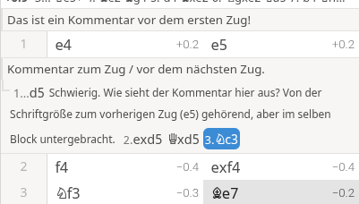
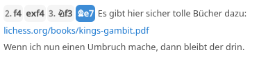

# Basic Usage of Lichess Studies

DIRECTOR'S NOTE: The following are suggestions with thematic blocks that will then be replaced by the concrete design.

## The Board

- Handling the board
- Options as in playing / analyzing
- Options relevant for studies

For operating the board via keyboard, see [Keyboard Shortcuts](#key-shortcuts).

## The Notation including Extensions

- How is the notation created?
- What additions are possible and how?
- Handling comments and variations
- Options of the hamburger menu

## Additional Options below the Board

### What are the tags, which of them should be filled when and how?

### The Meaning of the `SYNC` and `REC` Buttons

The `SYNC` and `REC` buttons are used to control the study. To understand this, we need to dive a bit deeper and consider the following scenarios:

* The editor alone in their study
* The trainer alone reviewing the study (not: creating)
* The editor together with participants in the study (in sync mode)

#### The Editor Alone

While creating a study (regardless of settings), the two buttons have the following meaning:

* The `SYNC` button is irrelevant, it only plays a role when you're in a study together with others.
* The `REC` button determines whether moves played are recorded in the study.

This means you can safely experiment when the `REC` button is set to `OFF`. The moves are displayed in the study but not saved. When you turn the `REC` button to `ON`, the moves played in the meantime while REC==`OFF` are discarded, and you continue where you were before. Therefore, there is no (simple) way to save moves you've experimented with later.

#### The Trainer Alone

If the trainer is the creator of the study, we are in the mode described above. If the trainer is in a different role, then we have the following behavior (described separately by role):

* Trainer is a contributor: The trainer can modify the study, i.e., they also have the REC and SYNC buttons visible, but unfortunately they cannot see the hidden moves. However, if they guess the moves that follow, these are displayed in the notation. If they make moves that are not in the study, these are recorded if the REC button is set to `ON`. However, they are not displayed in their notation! And a contributor cannot change this setting, as it is assigned solely by the owner of the study.
  This means that a trainer who is (only) a contributor is unfortunately unable to work fully with the study. The recommendation here is that they first create a copy of the study, modify it according to their preferences, before starting the lesson.
* Trainer is not a contributor, or not in the study: No difference from a participant, neither `REC` nor `SYNC` buttons are visible at the beginning, the trainer is like a passive participant. As soon as someone else changes the position, the `SYNC` button appears with a number. By pressing the `SYNC` button, you return to the current position, and the `SYNC` button disappears again. The trainer cannot control anything in the study!

#### The Editor Together with Others

This is the typical training situation, and here it's important to understand that **moves are only recorded in REC mode, and only these moves can then be shared with other participants via SYNC**. Therefore, you can only try out ad-hoc variations with others if these are then saved in the study. The combination REC==off and SYNC==on is not possible!

There is a simple trick here (which also has disadvantages): If you want to show something additional in a study without permanently changing the study, you can work with a clone of the study. However, this is only a copy, you should just get in the habit of deleting one-time copies afterwards.

### Comments: what works, what doesn't

Comments are allowed everywhere according to PGN. This is well supported by studies and plays a special role when designing interactive tasks or hiding moves. The comment before the first move is always visible. All other comments are now inserted between 2 moves, and it's somewhat philosophical whether the comment belongs to the move before or after. This is best seen when playing variations. There is no way to distinguish this from the UI.

Here are two screenshots, once the inline notation, then the column notation.

Due to the presentation, I tend to always relate comments to the previous move. This makes them easier for the reader to understand.

Comments can be created in any language, but special characters may be lost depending on later processing. It is plain text, no more complex text formats like Markdown are supported. Unfortunately, also no emoticons or smileys (which would then be rendered as actual images).

The only exception here are links, which are then also rendered as links. Line breaks are preserved, but of course there is no guarantee later that these will be correct in further processing.

If you have comments in multiply nested variations, they are displayed in increasingly smaller fonts. Comments are always displayed inline in all variations, only top-level comments are displayed without indentation.

#### Comments in Hidden Variations

When creating studies to teach others new topics, you should pay attention to when comments are visible to them. If a move is hidden, the comment after the move is also hidden. That is, if you want to ask something interactively, the answer should not already be visible beforehand.

#### Comments in Interactive Lessons

Interactive lessons (LINK) are used to let learners perform exercises independently. The main line is played, and the learner must guess the moves for one side. The comments before the learner's move are then displayed instead of the standard comment (What would you play in this position?). This allows you to make the exercises more lively.

If you insert a comment after a learner's move (i.e., an error you expect), this comment is also visible when the learner makes this wrong move. If you insert a comment after a learner's move in the main variation, this comment is also displayed, and you can continue by pressing the spacebar.

### NAGs in Detail

### Computer Analysis and Multi-Board

### Sharing Options

## The Opening Book & the Tablebase

- How can the opening book be used in studies?
- And how does the tablebase work here?

## Transitions to Studies

How can you get from various places in Lichess to a study, what options do you have?

- Including games in a study.
- Adding the current analysis to a study.
- Including a position from the board editor in a study.

## Keyboard Shortcuts {#key-shortcuts}

Relatively unknown, but especially useful for power users. I don't know since when the keyboard shortcuts for navigation on the board were introduced. Some of them are known to many, others are less well known. I try to stick to the categories of the Lichess help here. I have also had different experiences with the shortcut for keyboard help, but haven't figured out exactly when it works.

| Shortcut | Meaning | Explanation |
|--------|-----------|-----------|
| `?` | Keyboard help | Opens the help from which I took the following shortcuts. |
| **Navigation** |||
| Arrow left/right :arrow_left:/:arrow_right:  | Move forward/backward | |
| k/j  | Move forward/backward | Similar shortcuts as VIM |
| `SHIFT` :arrow_up:/:arrow_down: | Select variation | Only works on the move before a variation. First move is always the main variation. Then :arrow_right: to enter the variation. |
| `SHIFT` :arrow_left:/:arrow_right: | Jump to previous / next variation | You land on the move directly before the variation, and can then select the variation. |
| :arrow_up:/`0`/`Home` | Jump to first move | |
| :arrow_down:/`$`/`End` | Jump to last move of the main variation. | Even if the rest of the game was made into a variation via "Force variation". `$` didn't work for me.  |
| `n` | Next chapter | |
| `p` | Previous chapter | |
| Mouse Scroll | Scroll moves forward/backward | With the mouse you can scroll moves forward/backward. This is often much faster, yet precise. |
| `c` | Focus chat input field | After that you can directly submit a chat entry (if chat is allowed). |
| `d` | Comment on this position | Then jumps to the comment field. This also works before the first move (a kind of game comment at the beginning). |
| **Analysis** |||
| `l` | Computer analysis on/off | Stockfish is then started/stopped with the last settings.|
|  z | Activate / deactivate all computer analyses | This includes `l` from above. I couldn't find any other difference. The `Computer Analysis` tab is also disabled.|
| Spacebar | Play the best computer move | If Stockfish is not yet activated, it is activated with this, and the best move is played immediately. |
| `SHIFT` `I` | Toggle inline notation | |
| `x` | Show threats | See  |
| `a` | Arrow for the best move | Requires that computer analysis is on. The thickness of the arrows represents their quality. |
| `v` | Toggle variation arrows | These partially overlap with the arrows for the best moves. The arrow for the main variation is larger than the others.  |
| `e` | Toggle opening/endgame explorer | Depending on the phase the game is in. |
| `SHIFT` `SPACE` | Play the best explorer move. | Of course, this requires that the explorer is currently active. |
| `r` | Request a computer analysis | Never worked for me. |
| `ENTER` | Next: Learn from your mistakes | No idea what the meaning of this is. |
| `b` | Next gross blunder | Every own move marked with `??`. |
| `m` | Next mistake | Every own move marked with `?`. |
| `i` | Next dubious move | Every own move marked with `?!`. |
| **Comments** |||
| C | Add/edit comment | Shows / hides all textual comments. |
| `SHIFT` `C` | Show / hide comments | Shows / hides all textual comments. Annotations on the moves remain visible and preserved. |
| `g` | Shows the annotate with symbols dialog | |
| `1`\|`3`\|`5` | Good \| Brilliant \| Interesting move | Stands for `!`, `!!`, `!?`. Only one option selectable at a time. |
| `2`\|`4`\|`6` | Mistake \| Gross blunder \| Dubious move | Stands for `?`, `??`, `?!`. Only one option selectable at a time. |
| `SHIFT` `1` - `8` | The second column in the annotations dialog, from equal to winning. | Equal position (`=`) / Unclear position (`∞`)    Slight advantage White / Black (`⩲`/`⩱`)    White / Black is better (`±`/`∓`)    White / Black wins (`+−`/`-+`).   Only one of the 8 options selectable per move. |

One more important note:

* Most keyboard shortcuts only apply to the local board, the local display of the study, and have no effect on everyone else in the study.
* Where this is the case, I have explicitly mentioned it.

## Typical Usage Scenarios

- Analyze games of potential opponents.
- Prepare specific opening variations.
- Document typical middlegame and endgame strategies of your opponents.
- Create a tournament plan with goals and strategies.
