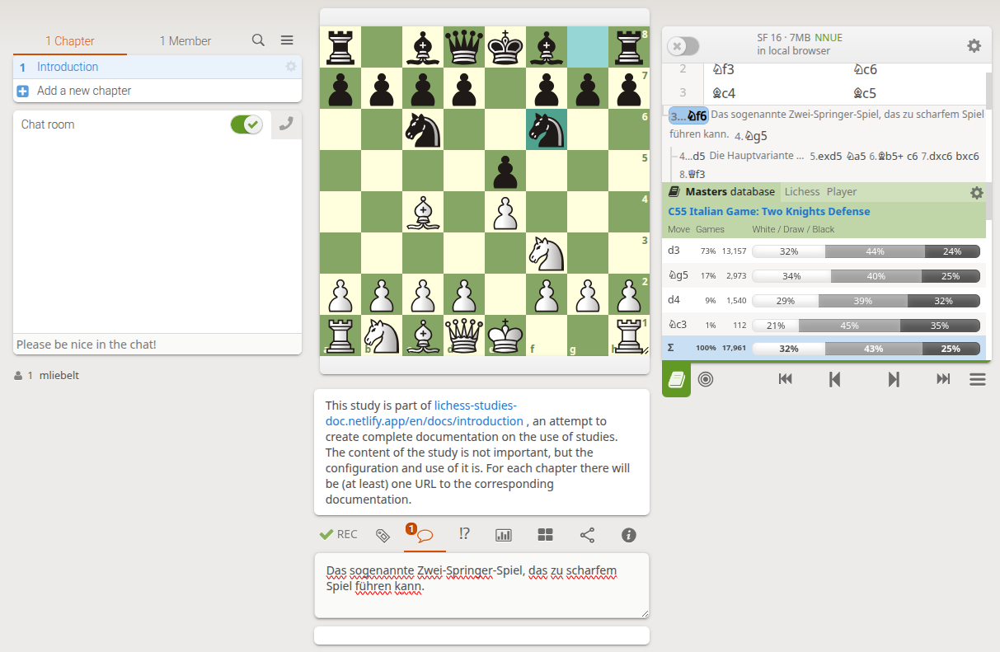

# First Steps with Lichess Studies

## Creating an Account

1. Visit [Lichess.org](https://lichess.org).
2. Click on "Sign in" in the top right corner.
3. Select "Register".
4. Fill out the form with:
   - Username
   - Email address
   - Password
5. Accept the terms of service.
6. Click on "Register".
7. Confirm your email address via the link sent to you.

Of course, you only need to do this once. After that, you can simply log in with your account (the username you chose) and your password in any current browser of your choice. Lichess usually remembers you as long as you don't explicitly log out.

It's technically possible to create multiple accounts on Lichess, but this shouldn't be overdone and is not well-regarded. We have created a separate Lichess account for our chess club, and we use it for the entire club. Usually, studies are then created with this account so that everyone in the club can manage the studies together. With some principles in mind, this works very well.

## Navigating the Lichess Interface

- **Main Menu**: At the top of the page, you'll find links to various areas such as Play, Learn, Community, and Tools.
- **Studies**: Under "Learn", you'll find the link to "Studies".
- **User Profile**: In the top right corner, you can click on your username to manage your profile and settings.

Since we mainly want to describe the studies here, we only explain which components of the interface are relevant. These are:

* \<Username\> > Language: You can change the language for using the interface, this has an immediate effect. But: Not all parts of the study interface are well internationalized. For the use of this documentation, you should have set the interface to English (or to German for the German part).
* Otherwise, there are many settings under the settings for the display of the board, notation, etc., but this applies to all tools equally. There are no specific settings for studies themselves, these are made individually for each study.

## Creating Your First Study

1. Navigate to the "Studies" section.
2. Click on "New Study".
3. Enter a name for your study.
4. Choose the privacy settings (keyword visibility: public, unlisted, or private).
5. Click on "Start".
6. You now see the creation dialog for creating a single chapter directly.
7. Leave the settings as they are and confirm with "Create Chapter".

Congratulations! You've created your first Lichess Study and are ready to dive deeper into the world of chess analysis. Do some experiments right away: Make some moves (main line); go back a few moves (the moves are automatically saved and remain); now choose a variation (and a variation in chess is created, without an upper limit).

*Figure 1: Example of a study with only one chapter, see [link to it](https://lichess.org/study/m1hylrkC)*

## Structure of the Studies Interface

The Lichess Study has a systematic structure that you should be familiar with when using it. The individual parts are displayed differently (depending on the available space). Here's a brief overview:

* Left side: Study management (the gear icon), division into chapters, member management, search, and a large chat room that each user can turn on or off.
* The board: The same board as in the analysis, or even the online game. All changes to the board settings are automatically applied here.
* Notation and tools: At the top, Stockfish with its configuration (more on this later); below that, the moves of the notation, including variations, comments, NAGs, ...; below that, the navigation (buttons for start, back, forward, end, and other options), on the far left the opening and endgame database.
* Bottom
  * If set, the study comment. I used it here to refer to the documentation (let's see when the study is discovered by others).
  * Below that, various tabs for additional tools, here the comment field.

That's enough for now. You can now share your created study with others by simply clicking in the URL bar of your browser and copying the URL there. This URL represents your study and is all you need to share the study. More on this later when we talk about sharing studies.
