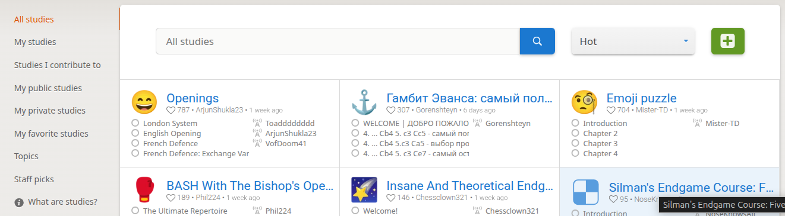
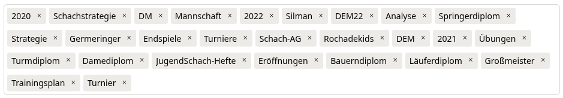

# Structure of Lichess Studies

## Managing Studies

Before we look at the structure of a study and its settings, here are some notes on managing studies in total.

*Figure 2: Management interface for studies*

* Studies are classified by who they belong to and whether you have access to them.
* Therefore, the first entries are the following:
  * All Studies: All studies you have access to and that are searchable. i.e., visibility public or by invitation. A study to which you are not invited with the visibility "Unlisted" is not listed here.
  * My studies: All studies that I own.
  * Studies I contribute to: All studies where you are a contributor (write permissions) or member (read permissions).
  * My public studies: The title is clear here, only studies that belong to you and have the visibility "Public" are displayed.
  * My private studies: All studies that belong to you and have either visibility "Unlisted" or "Invitation Only".
  * My favorite studies: Studies you have access to and that you have given a heart to.
  * Topics: Entry into study management via topics, see chapter below.
  * Staff picks: Studies that are public and suggested by the Lichess operators. Currently, the categories Opening, Middlegame, Endgame, World Chess Championships, Miscellaneous, and Puzzle Packs are distinguished.
  * What are Studies?: The only description of studies that gives a very good overview but leaves many things open. Here is the [link](https://lichess.org/@/lichess/blog/study-chess-the-lichess-way/V0KrLSkA).

### Handling Topics

Topics (tags) in studies are ways to pack keywords into a study to make it easier to find later. If you think you don't need this, you should remember it when searching among your (now) 150 studies. We can't provide a suitable structure for everyone here, but we can explain where topics can help.

*Figure 3: Catalog of Topics*

I create a good portion of the studies for our club, and I get along well with the following structure:

* Some studies have a time reference, where the year helps. These include, for example, games of players in tournaments that are to be analyzed together afterwards.
* Many studies are intended for a specific group of participants: for the team; the chess club; youth chess. This gives you a first distinction.
* Sometimes this is still too broad. We used to use the Brackeler method (today: Stappen), and have the terms "Pawn Diploma" (Stappen 1), "Knight Diploma" (Stappen 2), "Bishop Diploma" (Stappen 3), "Rook Diploma" (Stappen 4), "Queen Diploma" (Stappen 5). This fits quite well, I then have 3-5 studies per Stappen teacher's book.
* Freely created studies often have a relation to chess: Opening, Strategy, Tactics, Endgame, ...
* Often you take books and extract some chapters or sections from them. With a lot of material (Silman) a topic is also worthwhile here.

The access in the Lichess interface is now this:

1. You go to your studies, there to the topics.
2. You now see a list of all topics you have used in studies so far.
3. When clicking on a topic, all studies in which this topic was used are displayed on the right.

Alternatively, you can also click on a topic anywhere, and all studies with that topic will be displayed.

Limitation: Unfortunately, topics cannot be linked with each other (with and and or). But maybe that will come someday.

## Structure of a Study

When creating a study, you need to provide some information. We'll go through briefly what these entries mean:

1. **Flair**: You can assign an icon to each study, which is then displayed with the study. Possibly, if you structure the study sensibly, you can then distinguish them better from each other in a long list of studies.
1. **Name**: The main name of your study. This is displayed in the list of studies, along with other information. Otherwise, the name has no meaning. More on choosing meaningful names when we delve deeper into the organization of studies.
2. **Visibility**: Currently, 3 visibilities are supported:
    * Public: public studies are visible to every user, and most importantly, searchable. If you make studies Public, then you **want** the studies to be found.
    * Unlisted: these are visible but not findable. A user who is not actively involved in a study (more on this later) can only open it if they have the link to the study.
    * Invitate only: here only participants in the study (more on the different roles later) can open the study. Even if someone has the link, they still cannot access the content of the study.
3. **Chat**: There are also different possibilities here for who can participate in the chat in what form. I haven't been able to find a use case for this so far.
3. **Computer Analysis**: Various options are provided here as well:
    * Nobody: no one in the study can use the integrated engine. This is especially useful for training situations, so that participants can't quickly turn on the engine to avoid having to think for themselves.
    * Only me: i.e., the creator of the study. We'll come to the different roles of people in a study later.
    * Contributors: i.e., the active participants of a study who can change the study contents.
    * Members: i.e., the passive participants of a study who have access but cannot change content.
    * Everyone: i.e., everyone, really everyone who uses the study, can use computer analysis.
3. **Opening explorer & tablebase**: Studies offer access to the opening library and the endgame tablebases (all analyzed endgames with win, draw, loss) via the book button below the move list. The same settings as before can be chosen here. Relevant or not depending on what is being studied or practiced.
4. **Allow cloning**: Studies can be easily copied, with all contents, comments, etc. This is often the only way to work meaningfully with a study, especially if you want to change it without affecting the original study. Here too, you can decide whether and who is allowed to clone.
5. **Share & export**: This is about access to the "Share & Export" tab, the second from the right under the board. If this is forbidden, the functions contained therein, including the possibility to create a clone, are forbidden. The section below explains various sensible (and not sensible) combinations of settings.
6. **Enable sync**: This is one of the most important settings as it determines whether a study can be used with others in synchronous sessions or not. The following settings are possible:
    * Yes: Same position for everyone ==> Participants using a study at the same time see the same position at any given time. This is explained in detail, including how different roles affect usage. The owner of the study or all contributors determine which position is currently shown. Everyone else can make moves independently, but then decouples from the synchronous study. More on this later in XYZ.
    * No: Independent navigation for all ==> Any number of participants can open the study simultaneously and navigate completely freely. It's even possible to actively work on the moves of the study at the same time, of course in different chapters, but even in the same chapter. Always assuming that you have write permissions in the study.
7. **Pinned study comment**: The study comment is below the study all the time, so it's not a comment that relates to a chapter (and there to a position). One could imagine putting additional information about the study here. The values are "None" or "Directly below the board". Real URLs are converted to hyperlinks, but no other formatting is supported (yet).

When editing a study afterwards, you have the following additional options:

* **Delete Study**: Does what it says. For safety, you still have to enter the name of the study correctly to be able to delete a study.
* **Clear Chat**: If you're tired of the many comments in the chat and want to reset it. Until then, there was no way to change the chat afterwards.

### Roles of Study Participants

The following roles appear again and again and should therefore be explained centrally here. They are used in similar ways in different places.

* Owner of a study
  * Only the owner can change all settings of the study. No one else has access to the settings, so they can't even see them.
  * As far as visibility is concerned, the owner has the most possibilities. The various scenarios are examined here and then documented here.
* Contributors to a study
  * Contributors to a study can change everything in the content of a study, but nothing in the settings.
  * Assumption is that this applies especially to the modes of a study.
* Members of a study
  * They can participate in all studies they are invited to, but only as spectators.
  * Depending on the settings of the chapters, they can then replay the moves, but not change them. And if the moves are hidden, then also from the participants.
* Everyone else
  * can access the study if it's hidden but they have the link, or if it's open.
  * They have all possibilities that are explicitly granted to them, i.e., computer analysis, opening books and tablebases, or participation in chat (although I don't see any meaningful use case for that at all).

### Sensible Combinations of Settings

Some settings influence each other and should therefore be sensibly coordinated. Here are the two that make sense to coordinate, later (especially for chapters) more sensible combinations will be mentioned.

#### Cloning and Sharing & Exporting

As a reminder:

* Cloning is a way to duplicate a study and edit the duplicates.
* Sharing & Exporting is a way to export a study to other formats.

Here are the combinations that make sense from my point of view:

* Cloning and Sharing & Exporting for everyone: no restrictions, so others can do everything with it (except change). :heavy_check_mark:
* Cloning and Sharing & Exporting for participants: the restriction applies only to non-participants. :heavy_check_mark:
* Cloning for few, Sharing and Exporting rather allowed: this essentially allows everything that can be done after cloning, but more cumbersome. :question:
* Cloning for many, Sharing and Exporting restricted: this makes no sense at all, as cloning is only possible via the "Share and Export" tab. :exclamation:

My recommendation: Either allow generally or forbid, and always keep synchronized. :heavy_check_mark:

#### Computer Analysis and Opening Book & Tablebase

These two settings are not necessarily dependent on each other, but since they are settings for the entire study (i.e., all chapters), they should usually be synchronized.

* Computer Analysis and Opening Book & Tablebase for everyone: useful for collaborative work on content, without restrictions. :heavy_check_mark:
* Computer Analysis and Opening Book & Tablebase for participants: typical training situation, when the trainer knows more (or has access to more tools). :heavy_check_mark:
* Computer Analysis (no) and Opening Book & Tablebase (yes): This can make sense if you have complex positions (especially) where opening book and tablebase don't help. Just as well, you could forbid them (and thus have fewer icons on the interface). :question:
* Computer Analysis and Opening Book & Tablebase (no): This means no one is allowed to use the tools, I've never had this as a requirement. :exclamation:

## Organizing Chapters

- Create new chapters for different topics or games.
- Arrange chapters in a logical order.
- Use meaningful chapter names for easy navigation.

## Adding Variations

- Add alternative move sequences to explore different possibilities.
- Use sub-variations to represent complex branching.
- Keep the variation structure clear and not too deeply nested.

## Effective Comments and Annotations

- Use clear and precise language in your comments.
- Use annotation symbols (!, ?, !!, ??, etc.) to quickly evaluate moves.
- Combine text comments with symbolic annotations for comprehensive analysis.

## Collaboration in Studies

- Invite other users as collaborators.
- Use real-time cooperation for joint analyses.
- Define clear roles and responsibilities in collaborative studies.

A well-structured study greatly facilitates learning and analyzing chess games.
